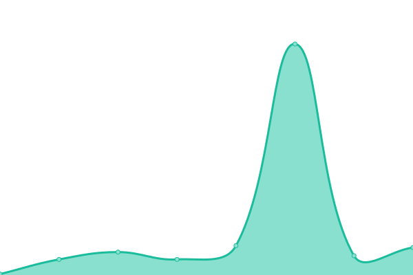

# [📈 Live Status](https://netz0.network): <!--live status--> **🟩 All systems operational**

This repository contains the open-source uptime monitor and status page for [Netz0 Network Status](https://netz0.network), powered by [Upptime](https://github.com/upptime/upptime).

With [Upptime](https://upptime.js.org), you can get your own unlimited and free uptime monitor and status page, powered entirely by a GitHub repository. We use [Issues](https://github.com/netz0network/status/issues) as incident reports, [Actions](https://github.com/netz0network/status/actions) as uptime monitors, and [Pages](https://netz0.network) for the status page.

<!--start: status pages-->
<!-- This summary is generated by Upptime (https://github.com/upptime/upptime) -->
<!-- Do not edit this manually, your changes will be overwritten -->
<!-- prettier-ignore -->
| URL | Status | History | Response Time | Uptime |
| --- | ------ | ------- | ------------- | ------ |
|  [Website](https://netz0.com) | 🟩 Up | [website.yml](https://github.com/netz0network/status/commits/HEAD/history/website.yml) | 

 1033ms
     
 | 

<a href="https://netz0.network/history/website">100.00%</a>
    

|  [Account & Support Area](https://netz0.com/global/check) | 🟩 Up | [account-and-support-area.yml](https://github.com/netz0network/status/commits/HEAD/history/account-and-support-area.yml) | 

 361ms
     
 | 

<a href="https://netz0.network/history/account-and-support-area">100.00%</a>
    

|  [Apps & Services](174.136.17.9) | 🟩 Up | [apps-and-services.yml](https://github.com/netz0network/status/commits/HEAD/history/apps-and-services.yml) | 

 39ms
     
 | 

<a href="https://netz0.network/history/apps-and-services">100.00%</a>
    

|  [DNS 1](ns1.netz0.net) | 🟩 Up | [dns-1.yml](https://github.com/netz0network/status/commits/HEAD/history/dns-1.yml) | 

 36ms
     
 | 

<a href="https://netz0.network/history/dns-1">100.00%</a>
    

|  [DNS 2](ns2.netz0.net) | 🟩 Up | [dns-2.yml](https://github.com/netz0network/status/commits/HEAD/history/dns-2.yml) | 

 37ms
     
 | 

<a href="https://netz0.network/history/dns-2">100.00%</a>
    

|  [DNS 3](ns3.netz0.net) | 🟩 Up | [dns-3.yml](https://github.com/netz0network/status/commits/HEAD/history/dns-3.yml) | 

 41ms
     
 | 

<a href="https://netz0.network/history/dns-3">100.00%</a>
    

<!--end: status pages-->

[**Visit our status website →**](https://netz0.network)

## 📄 License

- Powered by: [Upptime](https://github.com/upptime/upptime)
- Code: [MIT](./LICENSE) © [Netz0 Network Status](https://netz0.network)
- Data in the `./history` directory: [Open Database License](https://opendatacommons.org/licenses/odbl/1-0/)
